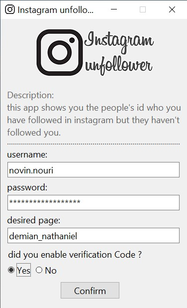
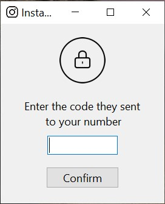
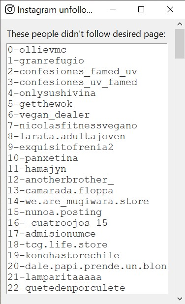

    

***

## Description

This app shows you the people's id who you have followed in instagram but they have not followed you. you can even check it for your friends and find out who  have not followed your friend's. we use [selenium](https://pypi.org/project/selenium/) package for instagram and use [tkinter](https://docs.python.org/3/library/tkinter.html) package for GUI(Graphical user interface).

### Installation & Requirements
- `pip install selenium` and download a [Drivers](https://pypi.org/project/selenium/) specific to your browser And put it in directory(where the files are).
- `pip install tkinter`
- `pip install Pillow`
- `pip install pyautogui`

### How to use it
1. type `python main.py`in cmd
2. enter username and password and ... 
3. if you're enable the **sms verification** for your instagram, instagram send code for your phone and type it in second screen, **don't** type it in your browser.
4. and wait for the third screen that contains the id to come to you .

### Screenshot

    
    
    

